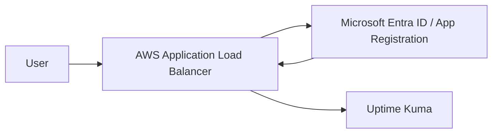

## What Is Uptime Kuma?

[Uptime Kuma](https://github.com/louislam/uptime-kuma) is a popular free and open-source self-hosted monitoring tool. It is commonly used to monitor the availability of websites, servers, APIs, and service endpoints.

It has two major strengths.

First, it supports a wide range of monitor types. In addition to common checks such as `Ping` and `HTTP(s)`, it can also monitor databases, DNS, certificate status, and more.

Second, it has rich notification integrations. It supports services such as `Telegram`, `Slack`, `Discord`, and `Teams`, which makes it very useful for small teams and personal operations.

Deployment is lightweight as well. The simplest approach is to run it with Docker. If you want something closer to a production setup, you can also install Node.js on a VM, manage the service with PM2, and replace the default `SQLite` database with `MySQL` or `MariaDB`.

## Why SSO Needs Extra Handling

Uptime Kuma currently does not provide native Single Sign-On (SSO), and its account management is designed more for internal use within a single Uptime Kuma instance.

If you want to delegate login control to an existing identity system, a common approach is to place an authentication proxy in front of it, such as [Authelia](https://www.authelia.com/integration/openid-connect/clients/uptime-kuma/) or [authentik](https://integrations.goauthentik.io/monitoring/uptime-kuma/).

However, if your environment is already running on AWS and your company uses Microsoft Entra ID as the identity provider, you do not necessarily need to maintain another SSO component. You can use the OIDC authentication feature of AWS Application Load Balancer (ALB), so ALB completes authentication before traffic reaches Uptime Kuma.

In other words, Uptime Kuma itself does not need to understand OIDC or implement SSO. It only needs to sit behind ALB, while authentication is handled by ALB and Entra ID.

## Architecture

The overall architecture looks like this:



The flow can be broken down into the following steps:

1. The user opens the Uptime Kuma domain.
2. ALB detects that the user is not authenticated and redirects the user to Entra ID.
3. After Entra ID completes authentication, the user returns to the ALB OIDC callback endpoint.
4. ALB creates a login session and forwards the request to the Uptime Kuma backend.


## Prerequisites

This article assumes that Uptime Kuma is already deployed and reachable through an internal endpoint or target group.

The deployment method does not matter. For example, it can be:

- Uptime Kuma running in Docker on EC2
- Uptime Kuma running on EC2 with Node.js and PM2
- Uptime Kuma deployed to Kubernetes with a Deployment or Helm

The important point is that Uptime Kuma must sit behind ALB, and the official external entry point should only go through ALB.

> After disabling Uptime Kuma's built-in authentication, the backend service should not be exposed directly to the Internet.
> Use Security Groups, NACLs, or Ingress rules so that only ALB can reach Uptime Kuma.
{: .prompt-warning}

## Disable Uptime Kuma Built-In Authentication

After signing in to Uptime Kuma, go to `Settings` -> `Security`, find `Disable Auth`, and run it.

The reason for this step is that authentication will be handled by ALB and Entra ID afterward. If Uptime Kuma keeps its own login page enabled, users will first authenticate with Entra ID and then be asked to sign in to Uptime Kuma again, which creates a double-login experience.

## Create the ALB

Because the Entra ID App Registration needs a redirect URI, it is better to create the ALB and the public domain first.

At the beginning, the ALB listener can be configured like this:

- Use HTTPS on the `443` listener
- Attach an ACM certificate
- Forward the default action to the Uptime Kuma target group for now

After confirming that the domain can reach Uptime Kuma, come back and add OIDC authentication to the listener.

## Create the Entra ID App Registration

In the Azure portal, go to App registrations and create a new app registration.

Recommended settings:

- Name: for example, `uptime-kuma`
- Supported account types: single tenant
- Redirect URI: select `Web`
- Redirect URI URL: enter `https://your-domain/oauth2/idpresponse`

After the app registration is created, record the Application (client) ID. You will use it later when configuring ALB.

Next, go to `Certificates & secrets`, create a client secret, and record the secret value. This value is shown only once, and it will also be used in the ALB OIDC settings.

If you want only specific users or groups to access Uptime Kuma, find this application under Enterprise applications and configure:

1. `Properties` -> set `Assignment required?` to `Yes`
2. `Users and groups` -> `Add user/group` to add the users or groups that should be allowed to use Uptime Kuma

> If you test with an Azure administrator account, you may not clearly see the effect of `Assignment required?` because of elevated permissions.
> Use a regular user account for testing to confirm that users who are not assigned cannot sign in.
{: .prompt-info}

## Modify the ALB Listener

After the App Registration is ready, return to the ALB listener and add OIDC authentication.

Here is a Terraform example:

```hcl
resource "aws_lb_listener" "uptime_kuma_port443" {
  load_balancer_arn = aws_lb.uptime_kuma.arn
  port              = "443"
  protocol          = "HTTPS"
  ssl_policy        = "ELBSecurityPolicy-TLS-1-2-2017-01"
  certificate_arn   = data.aws_acm_certificate.moxa.arn

  default_action {
    type  = "authenticate-oidc"
    order = 1

    authenticate_oidc {
      issuer = "https://login.microsoftonline.com/${var.entra_tenant_id}/v2.0"

      authorization_endpoint = "https://login.microsoftonline.com/${var.entra_tenant_id}/oauth2/v2.0/authorize"
      token_endpoint         = "https://login.microsoftonline.com/${var.entra_tenant_id}/oauth2/v2.0/token"
      user_info_endpoint     = "https://graph.microsoft.com/oidc/userinfo"

      client_id     = var.entra_client_id
      client_secret = var.entra_client_secret

      scope                      = "openid email profile"
      session_cookie_name        = "uptime_kuma_auth"
      session_timeout            = 3600
      on_unauthenticated_request = "authenticate"
    }
  }

  default_action {
    type             = "forward"
    order            = 2
    target_group_arn = aws_lb_target_group.uptime_kuma.arn
  }
}
```

Replace the following values:

- `var.entra_tenant_id`: the Entra ID tenant ID
- `var.entra_client_id`: the Application (client) ID from the App Registration
- `var.entra_client_secret`: the client secret value created in the App Registration
- `data.aws_acm_certificate.moxa.arn`: your ACM certificate ARN
- `aws_lb_target_group.uptime_kuma.arn`: the target group ARN for Uptime Kuma

If you prefer configuring it in the AWS Console, fill in the OIDC fields as follows:

```plaintext
Issuer:
https://login.microsoftonline.com/<tenant-id>/v2.0

Authorization endpoint:
https://login.microsoftonline.com/<tenant-id>/oauth2/v2.0/authorize

Token endpoint:
https://login.microsoftonline.com/<tenant-id>/oauth2/v2.0/token

User info endpoint:
https://graph.microsoft.com/oidc/userinfo

Client ID:
Application (client) ID from the App Registration

Client secret:
Client secret value from the App Registration
```

After the configuration is complete, open the Uptime Kuma domain again. Under normal conditions, you should first be redirected to the Microsoft sign-in page. After signing in successfully, you will enter the Uptime Kuma interface.

## Summary

Although Uptime Kuma does not provide native SSO, if it is deployed on AWS, ALB OIDC authentication can add that missing layer.

The benefit of this approach is that you do not need to maintain an extra authentication service such as Authelia or authentik, while still reusing the users, groups, and sign-in policies already managed in Entra ID.

One important point: after disabling Uptime Kuma's built-in authentication, ALB becomes the real security boundary. Make sure the backend Uptime Kuma service can only be accessed by ALB, so users cannot bypass ALB and reach the system directly.

## References

1. [uptime-kuma | GitHub](https://github.com/louislam/uptime-kuma)
2. [Boost Website Reliability with Uptime Kuma | Calpa's Blog](https://calpa.me/blog/uptime-kuma-boost-website-reliability/)
3. [Set Up Uptime Kuma to Monitor Service Availability | WebDong](https://www.webdong.dev/zh-tw/post/uptime-kuma/)
4. [Uptime Kuma | Authelia](https://www.authelia.com/integration/openid-connect/clients/uptime-kuma/)
5. [Integrate with Uptime Kuma | authentik](https://integrations.goauthentik.io/monitoring/uptime-kuma/)
