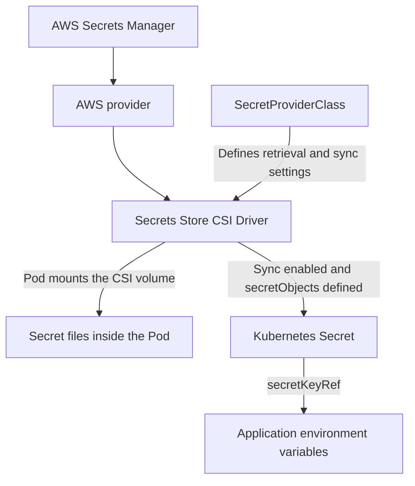

While deploying a service on EKS, I stored the application's sensitive data in AWS Secrets Manager and used the Secrets Store CSI Driver to make it available to Pods. The SecretProviderClass already existed and included `secretObjects`, but the application still reported a missing Secret at startup.

I had expected CSI to create the Kubernetes Secret once I applied the configuration. Eventually, I found that one setting controlling synchronization was still disabled: `syncSecret.enabled`. Updating it allowed the Secret to sync successfully and resolved the issue.

## Mounting Files and Syncing Secrets Are Separate Features

The Secrets Store CSI Driver, together with the AWS provider, can mount data from AWS Secrets Manager as files inside a Pod. If an application uses `secretKeyRef` to populate environment variables, that data also needs to be synchronized into a Kubernetes Secret.



These two ways of consuming secrets share the same data source but require different configuration. The `parameters` in a `SecretProviderClass` specify which data to retrieve from AWS. The `secretObjects` section defines the name, type, and keys of the resulting Kubernetes Secret. [AWS provider documentation](https://github.com/aws/secrets-store-csi-driver-provider-aws)

In addition, **a Pod must mount the corresponding CSI volume to trigger synchronization**. Creating a SecretProviderClass alone does not immediately create a Kubernetes Secret. [CSI Secret synchronization documentation](https://secrets-store-csi-driver.sigs.k8s.io/topics/sync-as-kubernetes-secret)

## The SecretProviderClass Existed, but the Secret Was Missing

The resource names below have been replaced with example names. The SecretProviderClass already contained the synchronization configuration:

```yaml
apiVersion: secrets-store.csi.x-k8s.io/v1
kind: SecretProviderClass
metadata:
  name: app-database-secret
  namespace: app
spec:
  provider: aws
  secretObjects:
    - secretName: app-db-secret
      type: Opaque
      data:
        - objectName: db-user
          key: db-user
        - objectName: db-password
          key: db-password
  parameters:
    region: ap-northeast-1
    objects: |
      - objectName: "<SECRETS_MANAGER_SECRET_ARN>"
        objectType: secretsmanager
        jmesPath:
          - path: username
            objectAlias: db-user
          - path: password
            objectAlias: db-password
```

This configuration extracts `username` and `password` from the JSON stored in Secrets Manager. The aliases `db-user` and `db-password` identify the mounted content, which is then synchronized to keys with the same names in `app-db-secret`.

However, querying the resources produced different results:

```bash
kubectl get secretproviderclass -n app
kubectl get secret app-db-secret -n app
```

The SecretProviderClass existed, but the Kubernetes Secret query returned `NotFound`. This shifted my attention to the driver's own synchronization settings. The SPC defined what to synchronize, but the driver also needed to have that feature enabled.

## Finding the Cause: syncSecret.enabled Was Disabled

The CSI driver in this environment was managed through Helm, so I first looked up the actual release name:

```bash
helm list -n kube-system
```

After finding `secrets-store-csi-driver`, I retrieved its full configuration, including default values:

```bash
helm get values secrets-store-csi-driver \
  -n kube-system \
  --all
```

The key setting was:

```yaml
syncSecret:
  enabled: false
```

Although the SecretProviderClass included `secretObjects`, `syncSecret.enabled` was still `false` in the Helm configuration. The RBAC required for synchronization had not been enabled.

`syncSecret.enabled` belongs to the **Helm values for the Secrets Store CSI Driver**, so the change needs to be made in the driver's configuration. It is neither a SecretProviderClass field nor a Pod annotation. The official chart uses this setting to control the roles and bindings required to synchronize Kubernetes Secrets. [CSI Helm chart configuration](https://github.com/kubernetes-sigs/secrets-store-csi-driver/blob/main/charts/secrets-store-csi-driver/README.md)

This also explains why inspecting only the driver container's startup arguments cannot tell you whether synchronization is enabled. The setting primarily affects RBAC; it does not appear as a corresponding `--sync-secret` argument in the container's args.

## Updating the Setting Resolved the Sync Issue

Once I found the cause, the fix was to update the existing Helm release and set `syncSecret.enabled` to `true`.

First, add the official chart repository:

```bash
helm repo add secrets-store-csi-driver \
  https://kubernetes-sigs.github.io/secrets-store-csi-driver/charts
helm repo update
```

Then update the driver. The command below uses the release name, namespace, and chart version `1.6.0` from this environment. Use the actual values for your environment when applying it elsewhere:

```bash
helm upgrade secrets-store-csi-driver \
  secrets-store-csi-driver/secrets-store-csi-driver \
  --version 1.6.0 \
  -n kube-system \
  --reuse-values \
  --set syncSecret.enabled=true
```

`--reuse-values` preserves the existing release configuration while overriding the setting being changed. The updated value is:

```yaml
syncSecret:
  enabled: true
```

The official installation documentation also lists `syncSecret.enabled=true` as the setting for enabling Kubernetes Secret synchronization. [CSI installation documentation](https://secrets-store-csi-driver.sigs.k8s.io/getting-started/installation)

After updating this setting, with a Pod mounting the corresponding CSI volume, the Kubernetes Secret defined in `secretObjects` was created successfully. That resolved the synchronization issue.

The missing piece was the driver's synchronization setting. The SecretProviderClass defines what to synchronize, the Pod mount triggers data retrieval, and `syncSecret.enabled` provides the permissions needed to synchronize Kubernetes Secrets. Together, they make the data in Secrets Manager available to applications that consume Kubernetes Secrets.
