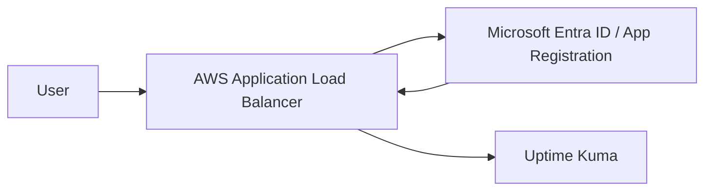

## Uptime Kuma とは

[Uptime Kuma](https://github.com/louislam/uptime-kuma) は、無料で使える人気のオープンソースのセルフホスト型監視ツールです。Web サイト、サーバー、API、サービスエンドポイントの可用性を監視する用途でよく使われます。

主な特徴は 2 つあります。

1 つ目は、監視タイプが豊富なことです。一般的な `Ping` や `HTTP(s)` に加えて、データベース、DNS、証明書の状態なども監視できます。

2 つ目は、通知連携が充実していることです。`Telegram`、`Slack`、`Discord`、`Teams` などに対応しており、小規模チームや個人運用でもかなり扱いやすいです。

デプロイも軽量です。最も簡単なのは Docker で起動する方法です。もう少し本番環境に近づけたい場合は、VM に Node.js をインストールし、PM2 でサービスを管理しつつ、デフォルトの `SQLite` を `MySQL` や `MariaDB` に置き換える構成も取れます。

## なぜ SSO を別途考える必要があるのか

Uptime Kuma には、現時点でネイティブの Single Sign-On（SSO）機能がありません。また、アカウント管理も単一の Uptime Kuma インスタンス内で使うことを前提にした作りです。

そのため、既存の ID 基盤にログイン制御を任せたい場合は、[Authelia](https://www.authelia.com/integration/openid-connect/clients/uptime-kuma/) や [authentik](https://integrations.goauthentik.io/monitoring/uptime-kuma/) のような認証プロキシを前段に置く構成がよく使われます。

ただし、環境がすでに AWS 上にあり、会社の ID プロバイダーとして Microsoft Entra ID を使っている場合、SSO 用のコンポーネントをもう 1 つ運用しなくてもよいケースがあります。AWS Application Load Balancer（ALB）の OIDC 認証機能を使えば、Uptime Kuma に通信が届く前に ALB 側で認証を完了できます。

言い換えると、Uptime Kuma 自体が OIDC を理解したり、SSO を実装したりする必要はありません。Uptime Kuma を ALB の背後に置き、認証は ALB と Entra ID に任せる構成です。

## アーキテクチャ

全体の構成は次のようになります。



処理の流れは次のとおりです。

1. ユーザーが Uptime Kuma のドメインにアクセスします。
2. ALB はユーザーが未認証であることを検知し、Entra ID にリダイレクトします。
3. Entra ID で認証が完了すると、ALB の OIDC callback endpoint に戻ります。
4. ALB がログインセッションを作成し、リクエストをバックエンドの Uptime Kuma に転送します。


## 前提条件

この記事では、Uptime Kuma のデプロイが完了しており、内部 endpoint または target group 経由でサービスに到達できる状態を前提にします。

デプロイ方法は問いません。たとえば、次のような構成で問題ありません。

- EC2 上で Docker を使って Uptime Kuma を起動している
- EC2 上に Node.js を入れ、PM2 で Uptime Kuma を管理している
- Kubernetes に Deployment または Helm でデプロイしている

重要なのは、Uptime Kuma を ALB の背後に配置し、正式な外部入口は ALB のみにすることです。

> Uptime Kuma の組み込み認証を無効化した後は、バックエンドサービスを Internet に直接公開しないでください。
> Security Group、NACL、Ingress ルールなどで、ALB からのみ Uptime Kuma に到達できるようにします。
{: .prompt-warning}

## Uptime Kuma の組み込み認証を無効化する

Uptime Kuma にログインしたら、`設定` -> `セキュリティ` に移動し、`認証の無効化` を実行します。

この手順が必要なのは、以後の認証を ALB と Entra ID に任せるためです。Uptime Kuma 側のログイン画面を残したままだと、ユーザーは Entra ID で認証した後に、さらに Uptime Kuma でもログインを求められるため、二重ログインのような体験になります。

## ALB を作成する

Entra ID のアプリの登録では redirect URI を設定する必要があるため、先に ALB と公開用ドメインを用意しておくのがおすすめです。

最初の段階では、ALB listener は次のような構成でかまいません。

- `443` listener で HTTPS を使用する
- ACM 証明書を割り当てる
- default action はいったん Uptime Kuma の target group に forward する

ドメインから Uptime Kuma に正常にアクセスできることを確認したら、後で listener に OIDC 認証を追加します。

## Entra ID のアプリの登録を作成する

Azure portal で `App registrations`（アプリの登録）に移動し、`New registration`（新規登録）から新しいアプリの登録を作成します。

推奨設定は次のとおりです。

- `Name`：例として `uptime-kuma`
- `Supported account types`（サポートされているアカウントの種類）：`Single tenant only`（シングル テナントのみ）
- `Redirect URI`（リダイレクト URI）：`Web` を選択
- `Redirect URI` の URL：`https://your-domain/oauth2/idpresponse` を入力

作成後、`Application (client) ID`（アプリケーション (クライアント) ID）を控えておきます。後で ALB を設定するときに使います。

次に、`Certificates & secrets`（証明書とシークレット）で `Client secrets`（クライアント シークレット）を開き、`New client secret`（新しいクライアント シークレット）を作成して secret value を控えます。この値は一度しか表示されず、ALB の OIDC 設定にも必要です。

特定のユーザーまたはグループだけが Uptime Kuma に入れるようにしたい場合は、`Enterprise applications`（エンタープライズ アプリケーション）からこの application を探し、次のように設定します。

1. `Properties`（プロパティ）-> `Assignment required?`（ユーザー割り当てを必要とする設定）を `Yes` にする
2. `Users and groups`（ユーザーとグループ）-> `Add user/group`（ユーザーまたはグループの追加）で、Uptime Kuma の利用を許可するユーザーまたはグループを追加する

> Azure 管理者アカウントでテストすると、権限が高すぎるため `Assignment required?` の制限が分かりにくい場合があります。
> 一般ユーザーアカウントでもテストし、割り当てられていないユーザーがサインインできないことを確認してください。
{: .prompt-info}

## ALB Listener を変更する

アプリの登録ができたら、ALB listener に戻って OIDC 認証を追加します。

以下は Terraform の例です。

```hcl
resource "aws_lb_listener" "uptime_kuma_port443" {
  load_balancer_arn = aws_lb.uptime_kuma.arn
  port              = "443"
  protocol          = "HTTPS"
  ssl_policy        = "ELBSecurityPolicy-TLS-1-2-2017-01"
  certificate_arn   = data.aws_acm_certificate.moxa.arn

  default_action {
    type  = "authenticate-oidc"
    order = 1

    authenticate_oidc {
      issuer = "https://login.microsoftonline.com/${var.entra_tenant_id}/v2.0"

      authorization_endpoint = "https://login.microsoftonline.com/${var.entra_tenant_id}/oauth2/v2.0/authorize"
      token_endpoint         = "https://login.microsoftonline.com/${var.entra_tenant_id}/oauth2/v2.0/token"
      user_info_endpoint     = "https://graph.microsoft.com/oidc/userinfo"

      client_id     = var.entra_client_id
      client_secret = var.entra_client_secret

      scope                      = "openid email profile"
      session_cookie_name        = "uptime_kuma_auth"
      session_timeout            = 3600
      on_unauthenticated_request = "authenticate"
    }
  }

  default_action {
    type             = "forward"
    order            = 2
    target_group_arn = aws_lb_target_group.uptime_kuma.arn
  }
}
```

置き換える必要がある値は次のとおりです。

- `var.entra_tenant_id`：Entra ID tenant ID
- `var.entra_client_id`：アプリの登録の Application (client) ID（アプリケーション (クライアント) ID）
- `var.entra_client_secret`：アプリの登録で作成した client secret value
- `data.aws_acm_certificate.moxa.arn`：ACM 証明書の ARN
- `aws_lb_target_group.uptime_kuma.arn`：Uptime Kuma の target group ARN

AWS Console で設定する場合は、OIDC の各欄に次の値を入力します。

```plaintext
Issuer:
https://login.microsoftonline.com/<tenant-id>/v2.0

Authorization endpoint:
https://login.microsoftonline.com/<tenant-id>/oauth2/v2.0/authorize

Token endpoint:
https://login.microsoftonline.com/<tenant-id>/oauth2/v2.0/token

User info endpoint:
https://graph.microsoft.com/oidc/userinfo

Client ID:
アプリの登録の Application (client) ID

Client secret:
アプリの登録で作成した client secret value
```

設定が完了したら、もう一度 Uptime Kuma のドメインを開きます。正常であれば、まず Microsoft のサインイン画面にリダイレクトされます。サインインに成功すると、Uptime Kuma の画面に入れるようになります。

## まとめ

Uptime Kuma 自体にはネイティブの SSO 機能がありませんが、AWS 上にデプロイしている場合は、ALB の OIDC 認証でその不足分を補えます。

この方法のメリットは、Authelia や authentik のような認証サービスを別途運用せずに、Entra ID で管理しているユーザー、グループ、サインインポリシーをそのまま使えることです。

ただし、Uptime Kuma の組み込み認証を無効化した後は、実質的な保護境界が ALB になります。ALB を迂回して直接アクセスされないように、バックエンドの Uptime Kuma サービスは必ず ALB からのみ到達できるようにしてください。

## 参考資料

1. [uptime-kuma | GitHub](https://github.com/louislam/uptime-kuma)
2. [運用 Uptime Kuma 強化網站可靠性 | Calpa 的煉金工房](https://calpa.me/blog/uptime-kuma-boost-website-reliability/)
3. [設置 Uptime Kuma 監控服務在線狀態 | WebDong](https://www.webdong.dev/zh-tw/post/uptime-kuma/)
4. [Uptime Kuma | Authelia](https://www.authelia.com/integration/openid-connect/clients/uptime-kuma/)
5. [Integrate with Uptime Kuma | authentik](https://integrations.goauthentik.io/monitoring/uptime-kuma/)
