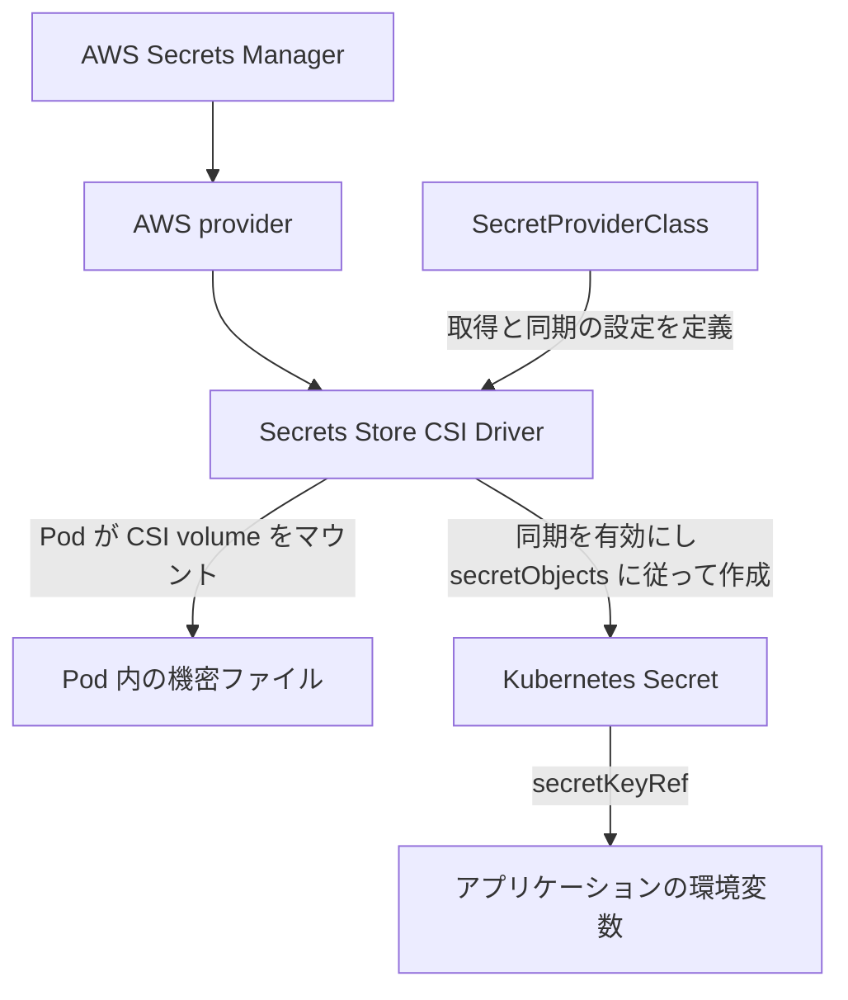

今回 EKS にサービスをデプロイする際、アプリケーションに必要な機密情報を AWS Secrets Manager に保存し、Secrets Store CSI Driver を通じて Pod に提供する構成にしました。SecretProviderClass は作成済みで、`secretObjects` も設定していましたが、アプリケーションの起動時に Secret が見つからないというエラーが発生しました。

設定を適用すれば、CSI が Kubernetes Secret も同期して作成してくれると思っていました。しかし調べてみると、同期を制御する `syncSecret.enabled` という設定が無効のままでした。この設定を更新すると、Secret が正常に同期され、問題は解決しました。

## ファイルのマウントと Secret の同期は別の機能

Secrets Store CSI Driver と AWS provider を組み合わせると、AWS Secrets Manager のデータを Pod 内のファイルとしてマウントできます。アプリケーションが `secretKeyRef` を使って環境変数に値を読み込む場合は、さらに Kubernetes Secret への同期が必要です。



この 2 つの利用方法は同じデータソースを使いますが、必要な設定は異なります。`SecretProviderClass` の `parameters` は AWS から取得するデータを定義し、`secretObjects` は同期先の Kubernetes Secret の名前、種類、キーを定義します。[AWS provider 公式ドキュメント](https://github.com/aws/secrets-store-csi-driver-provider-aws)

また、**同期を開始するには、Pod が対応する CSI volume をマウントする必要があります**。SecretProviderClass を作成しただけでは、Kubernetes Secret はすぐには作成されません。[CSI Secret 同期ドキュメント](https://secrets-store-csi-driver.sigs.k8s.io/topics/sync-as-kubernetes-secret)

## SecretProviderClass は存在するのに Secret が作成されない

以下では、リソース名を例示用の名前に置き換えています。当時の SecretProviderClass には、すでに同期の設定が含まれていました。

```yaml
apiVersion: secrets-store.csi.x-k8s.io/v1
kind: SecretProviderClass
metadata:
  name: app-database-secret
  namespace: app
spec:
  provider: aws
  secretObjects:
    - secretName: app-db-secret
      type: Opaque
      data:
        - objectName: db-user
          key: db-user
        - objectName: db-password
          key: db-password
  parameters:
    region: ap-northeast-1
    objects: |
      - objectName: "<SECRETS_MANAGER_SECRET_ARN>"
        objectType: secretsmanager
        jmesPath:
          - path: username
            objectAlias: db-user
          - path: password
            objectAlias: db-password
```

この設定では、Secrets Manager の JSON から `username` と `password` を取得します。マウントする内容に `db-user`、`db-password` という別名を付け、`app-db-secret` 内の同名のキーに同期します。

ところが、リソースを確認すると結果が異なりました。

```bash
kubectl get secretproviderclass -n app
kubectl get secret app-db-secret -n app
```

SecretProviderClass は存在していましたが、Kubernetes Secret の取得は `NotFound` になりました。そこで、driver 自体の同期設定に注目しました。SPC で「何を同期するか」を定義していても、driver 側でその機能が有効になっている必要があります。

## 原因は syncSecret.enabled が無効だったこと

この環境の CSI driver は Helm で管理していたため、まず実際のリリース名を調べました。

```bash
helm list -n kube-system
```

`secrets-store-csi-driver` が見つかったので、デフォルト値を含む設定全体を取得しました。

```bash
helm get values secrets-store-csi-driver \
  -n kube-system \
  --all
```

原因となっていたのは、次の設定です。

```yaml
syncSecret:
  enabled: false
```

SecretProviderClass に `secretObjects` を記述していても、Helm 設定の `syncSecret.enabled` は `false` のままで、同期に必要な RBAC が有効になっていませんでした。

`syncSecret.enabled` は **Secrets Store CSI Driver の Helm values** に属する設定なので、driver 側の設定を変更します。SecretProviderClass のフィールドでも、Pod の annotation でもありません。公式 chart では、この設定で Kubernetes Secret の同期に必要な roles と bindings を制御しています。[CSI Helm chart の設定ドキュメント](https://github.com/kubernetes-sigs/secrets-store-csi-driver/blob/main/charts/secrets-store-csi-driver/README.md)

そのため、driver コンテナの起動引数を見るだけでは、同期機能が有効かどうかは判断できません。この設定が主に変更するのは RBAC であり、対応する `--sync-secret` という引数がコンテナの args に追加されるわけではありません。

## 設定を更新すると Secret が正常に同期された

原因が分かったので、既存の Helm リリースを更新し、`syncSecret.enabled` を `true` に変更しました。

まず、公式 chart リポジトリを追加します。

```bash
helm repo add secrets-store-csi-driver \
  https://kubernetes-sigs.github.io/secrets-store-csi-driver/charts
helm repo update
```

続いて driver を更新します。以下は当時のリリース名、namespace、chart バージョン `1.6.0` を使用した例です。別の環境に適用する場合は、その環境の値に置き換えてください。

```bash
helm upgrade secrets-store-csi-driver \
  secrets-store-csi-driver/secrets-store-csi-driver \
  --version 1.6.0 \
  -n kube-system \
  --reuse-values \
  --set syncSecret.enabled=true
```

`--reuse-values` で既存のリリース設定を引き継ぎ、今回変更する設定を上書きします。更新後の値は次のとおりです。

```yaml
syncSecret:
  enabled: true
```

公式のインストールドキュメントでも、Kubernetes Secret の同期を有効にする設定として `syncSecret.enabled=true` が案内されています。[CSI インストールドキュメント](https://secrets-store-csi-driver.sigs.k8s.io/getting-started/installation)

この設定を更新すると、Pod が対応する CSI volume をマウントした状態で、`secretObjects` に定義した Kubernetes Secret が正常に作成されました。これで今回の同期問題は解決しました。

今回見落としていたのは、driver 側の同期設定でした。SecretProviderClass が同期内容を定義し、Pod のマウントがデータ取得を開始し、`syncSecret.enabled` が Kubernetes Secret の同期に必要な権限を設定します。この 3 つがそろうことで、Kubernetes Secret を参照するアプリケーションに Secrets Manager のデータを提供できます。
