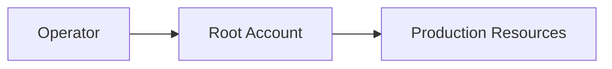
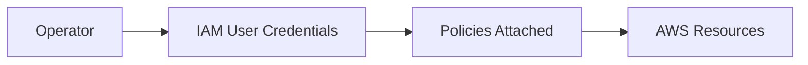
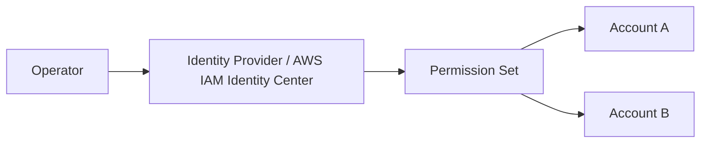
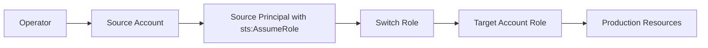

登入 AWS Cloud Console 有很多種方式，

使用 root 帳號登入（不建議），

使用 IAM User 的 Credentials 登入，

使用 SAML 串接 Azure 登入 AWS Cloud Console，

串接 AWS SSO 後登入，

其中有一個最為特殊的登入方式，

那就是登入一個 AWS 帳號後，

透過 Switch Role 的方式，

登入到另一個 AWS 帳號，

今天這篇就是打算來介紹這個特別的登入方式，

以及設定方法。

## 用圖片比較不同登入方式

下面是四個常見情境的實際流程圖：

### 情境 A：直接使用 Root 登入



### 情境 B：使用 IAM User 登入



### 情境 C：使用 SSO / Federation 登入



### 情境 D：先登入來源帳號，再 Switch Role 到目標帳號



如果你只看結果，都是「成功進入 Console」。

但從權限管理角度，它們本質上差很多：

| 方式 | 登入身份 | 是否建議長期使用 | 典型情境 |
| --- | --- | --- | --- |
| Root 帳號 | Account Root User | 否 | 帳號初始化、極少數緊急操作 |
| IAM User | 固定使用者憑證 | 視組織政策 | 小型團隊、尚未導入 SSO |
| SAML/SSO | 企業身份系統 | 是 | 中大型組織、集中控管 |
| Switch Role | 先登入來源，再切換角色 | 是 | 跨帳號維運、Prod 權限隔離 |

## 為什麼我們需要

很多團隊會把 Production 帳號獨立出來，

平時工程師只登入一般工作帳號，

需要處理正式環境時，再透過 Switch Role 進去，

概念上很像「進 Production 前的跳板機」。

這樣做至少有三個優點：

1. 降低高權限長期暴露風險
2. 清楚區分日常帳號與目標環境責任
3. CloudTrail 稽核時更容易追蹤「誰在何時切到哪個角色」

> 實務上可以把「可切換的 Role」當作一道明確邊界：
> 先通過身份驗證，再通過角色授權，才有機會操作敏感資源。
{: .prompt-info}

## 設定方式

以下示範最常見的跨帳號情境：

1. 使用者先登入來源帳號（A）
2. 在目標帳號（B）建立一個可被 A Assume 的 Role
3. 使用者在 Console 透過 Switch Role 切換到 B

### 步驟 1：在目標帳號建立 IAM Role

目標帳號（B）建立 Role 時，

先把 Permission Policy 定義好，

例如只允許讀取 CloudWatch Logs 與查看 EC2：

```json
{
	"Version": "2012-10-17",
	"Statement": [
		{
			"Effect": "Allow",
			"Action": [
				"logs:DescribeLogGroups",
				"logs:DescribeLogStreams",
				"logs:GetLogEvents",
				"ec2:DescribeInstances"
			],
			"Resource": "*"
		}
	]
}
```

### 步驟 2：設定 Trust Relationship

接著在目標帳號（B）的這個 Role 設定信任政策，

允許來源帳號（A）中特定 IAM User 或 Role Assume 進來。

下面是常見範例（允許來源帳號中的 `ops-admin` Role）：

```json
{
	"Version": "2012-10-17",
	"Statement": [
		{
			"Effect": "Allow",
			"Principal": {
				"AWS": "arn:aws:iam::<source_account_id>:role/ops-admin"
			},
			"Action": "sts:AssumeRole"
		}
	]
}
```

如果你想更嚴格，還可以搭配條件限制（像是 MFA）。

```json
{
	"Version": "2012-10-17",
	"Statement": [
		{
			"Effect": "Allow",
			"Principal": {
				"AWS": "arn:aws:iam::<source_account_id>:role/ops-admin"
			},
			"Action": "sts:AssumeRole",
			"Condition": {
				"Bool": {
					"aws:MultiFactorAuthPresent": "true"
				}
			}
		}
	]
}
```

### 步驟 3：確認來源端也有 AssumeRole 權限

來源帳號（A）的使用者或角色，

需要有對目標 Role 的 `sts:AssumeRole` 權限，否則無法切換。

```json
{
	"Version": "2012-10-17",
	"Statement": [
		{
			"Effect": "Allow",
			"Action": "sts:AssumeRole",
			"Resource": "arn:aws:iam::<target_account_id>:role/<target_role_name>"
		}
	]
}
```

### 步驟 4：在 Console 執行 Switch Role

在右上角帳號選單點選 `Switch role`，

填入：

1. Account ID（目標帳號）
2. Role name（目標角色名稱）
3. Display name（自訂，方便辨識）

成功後你會看到 Console 右上角身份切換，

表示你已經在「同一個瀏覽器 session 中」使用另一個角色權限。

## 常見錯誤與排查

### 1) AccessDenied: not authorized to perform sts:AssumeRole

通常是來源端沒有 `sts:AssumeRole` 權限，

或目標端 Trust Relationship 沒有信任到正確 Principal。

### 2) 找得到 Role 但切換失敗

檢查 Account ID、Role name 是否正確，

也要確認是切到「目標帳號的角色」，不是來源帳號同名角色。

### 3) 已切換成功但看不到資源

通常是目標 Role 的 Permission Policy 太小，

或資源在不同 Region。

## 不同登入方式使用情境

可以用這個方式快速決策：

1. 個人學習或一次性操作：IAM User（短期可接受）
2. 團隊正式環境：SSO + Switch Role
3. 高敏感帳號（如 Production）：預設無權限，需要時才 Switch Role

最常見且穩健的組合其實是：

先用 SSO 完成身份驗證，

再用 Switch Role 切到不同帳號與不同權責角色。

## 小結

Switch Role 的核心價值，不只是「跨帳號方便」，

更重要的是把身份與權限分層，

讓你能用更可控的方式進入高風險環境。

一句話總結：

平時在低權限身份工作，需要時再短暫切換到目標角色。

這就是 AWS 多帳號治理裡非常關鍵的一步。

## 參考資料

1. AWS IAM User Guide - Switching to a role (console): https://docs.aws.amazon.com/IAM/latest/UserGuide/id_roles_use_switch-role-console.html
2. AWS IAM User Guide - Tutorial: Delegate access across AWS accounts using IAM roles: https://docs.aws.amazon.com/IAM/latest/UserGuide/tutorial_cross-account-with-roles.html
3. AWS IAM JSON policy elements reference: https://docs.aws.amazon.com/IAM/latest/UserGuide/reference_policies_elements.html