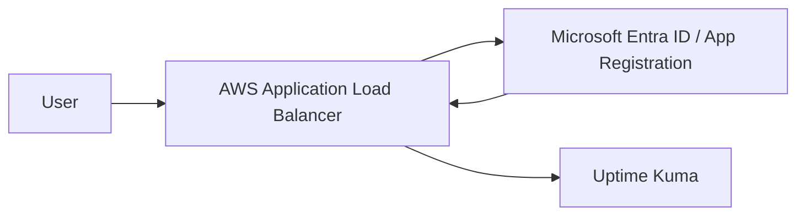

## Uptime Kuma 是什麼

[Uptime Kuma](https://github.com/louislam/uptime-kuma) 是一套熱門的免費開源自架監控工具，常用來監控網站、伺服器、API 與服務端點的可用性。

它的優點主要有兩個。

第一，監控項目很完整，除了常見的 `Ping`、`HTTP(s)`，也支援資料庫、DNS、憑證狀態等檢查方式。

第二，通知整合很豐富，支援 `Telegram`、`Slack`、`Discord`、`Teams` 等多種通訊服務，對小型團隊或個人維運來說非常好用。

部署方式也很輕量。最簡單可以直接用 Docker 跑起來；如果想要更貼近正式環境，也可以在 VM 上安裝 Node.js，再透過 PM2 管理服務，並把資料庫從預設的 `SQLite` 換成 `MySQL` 或 `MariaDB`。

## 為什麼需要額外處理 SSO

Uptime Kuma 目前沒有原生的 Single Sign-On（SSO）功能，而且帳號管理也偏向單一站台內部使用。

所以如果希望把登入控管交給既有的身份系統，常見作法會是在前面多放一層認證代理，例如 [Authelia](https://www.authelia.com/integration/openid-connect/clients/uptime-kuma/) 或 [authentik](https://integrations.goauthentik.io/monitoring/uptime-kuma/)。

不過，如果環境已經在 AWS 上，且公司身份來源是 Microsoft Entra ID，其實不一定要再額外維護一套 SSO 工具。我們可以直接利用 AWS Application Load Balancer（ALB）的 OIDC authentication 功能，讓 ALB 在流量進入 Uptime Kuma 前先完成登入驗證。

換句話說，Uptime Kuma 本身不需要懂 OIDC，也不需要實作 SSO。它只要被放在 ALB 後面，驗證就交給 ALB 與 Entra ID 處理。

## 架構

整體架構會像這樣：



流程可以拆成幾個步驟：

1. 使用者瀏覽 Uptime Kuma 的網域。
2. ALB 發現使用者尚未通過驗證，將使用者導向 Entra ID 登入。
3. Entra ID 驗證成功後，回到 ALB 的 OIDC callback endpoint。
4. ALB 建立登入 session，並把請求轉發到後端的 Uptime Kuma。


## 實作前提

這篇文章會假設你已經完成 Uptime Kuma 的部署，而且可以透過內部 endpoint 或 target group 連到服務。

部署方式不限，可以是：

- EC2 上用 Docker 啟動 Uptime Kuma
- EC2 上安裝 Node.js，並透過 PM2 管理服務
- Kubernetes 中用 Deployment 或 Helm 部署

重點是：Uptime Kuma 必須放在 ALB 後面，且正式對外入口應該只走 ALB。

> 停用 Uptime Kuma 內建驗證後，後端服務不應該直接暴露在 Internet 上。
> 建議讓 Security Group、NACL 或 Ingress 規則只允許 ALB 連到 Uptime Kuma。
{: .prompt-warning}

## 停用 Uptime Kuma 內建驗證

登入 Uptime Kuma 後，進入 `設定` → `安全性`，找到 `停用驗證` 並執行。

這一步的原因是，後續身份驗證會交給 ALB 和 Entra ID 處理。如果 Uptime Kuma 仍保留自己的登入頁，使用者就會先通過 Entra ID，再被 Uptime Kuma 要求登入一次，體驗上會變成雙重登入。

## 建立 ALB

因為 Entra ID App Registration 需要設定 redirect URI，所以建議先建立 ALB 與對外網域。

一開始 ALB 的 listener 可以先這樣設定：

- `443` listener 使用 HTTPS
- 綁定 ACM 憑證
- default action 先 forward 到 Uptime Kuma 的 target group

確認網域可以正常連到 Uptime Kuma 後，再回來把 listener 加上 OIDC authentication。

## 建立 Entra ID App Registration

到 Azure Portal 的 App registrations 頁面，建立新的 App Registration。

建議設定如下：

- Name：例如 `uptime-kuma`
- Supported account types：選擇單一租用戶
- Redirect URI：選擇 `Web`
- Redirect URI URL：填入 `https://你的網域/oauth2/idpresponse`

建立完成後，先記下 Application（client）ID，後面設定 ALB 時會用到。

接著到 `Certificates & secrets` 建立一組 client secret，並記下 secret value。這個值只會顯示一次，後續同樣會填到 ALB 的 OIDC 設定。

如果你希望只有特定使用者或群組可以進入 Uptime Kuma，可以到 Enterprise applications 找到這個 application，設定：

1. `Properties` → `Assignment required?` 設為 `Yes`
2. `Users and groups` → `Add user/group` 加入允許使用 Uptime Kuma 的使用者或群組

> 如果你使用 Azure 管理員帳號測試，可能會因為權限過高而看不出 `Assignment required?` 的限制效果。
> 建議另外找一般使用者帳號測試，確認未被指派的使用者無法登入。
{: .prompt-info}

## 修改 ALB Listener

App Registration 建好後，就可以回到 ALB listener 加上 OIDC authentication。

以下是一個 Terraform 範例：

```hcl
resource "aws_lb_listener" "uptime_kuma_port443" {
  load_balancer_arn = aws_lb.uptime_kuma.arn
  port              = "443"
  protocol          = "HTTPS"
  ssl_policy        = "ELBSecurityPolicy-TLS-1-2-2017-01"
  certificate_arn   = data.aws_acm_certificate.moxa.arn

  default_action {
    type  = "authenticate-oidc"
    order = 1

    authenticate_oidc {
      issuer = "https://login.microsoftonline.com/${var.entra_tenant_id}/v2.0"

      authorization_endpoint = "https://login.microsoftonline.com/${var.entra_tenant_id}/oauth2/v2.0/authorize"
      token_endpoint         = "https://login.microsoftonline.com/${var.entra_tenant_id}/oauth2/v2.0/token"
      user_info_endpoint     = "https://graph.microsoft.com/oidc/userinfo"

      client_id     = var.entra_client_id
      client_secret = var.entra_client_secret

      scope                      = "openid email profile"
      session_cookie_name        = "uptime_kuma_auth"
      session_timeout            = 3600
      on_unauthenticated_request = "authenticate"
    }
  }

  default_action {
    type             = "forward"
    order            = 2
    target_group_arn = aws_lb_target_group.uptime_kuma.arn
  }
}
```

其中需要替換的變數如下：

- `var.entra_tenant_id`：Entra ID tenant ID
- `var.entra_client_id`：App Registration 的 Application（client）ID
- `var.entra_client_secret`：App Registration 建立的 client secret value
- `data.aws_acm_certificate.moxa.arn`：你的 ACM 憑證 ARN
- `aws_lb_target_group.uptime_kuma.arn`：Uptime Kuma 所在的 target group ARN

如果你習慣在 AWS Console 裡設定，OIDC 欄位可以依照下面填：

```plaintext
Issuer:
https://login.microsoftonline.com/<tenant-id>/v2.0

Authorization endpoint:
https://login.microsoftonline.com/<tenant-id>/oauth2/v2.0/authorize

Token endpoint:
https://login.microsoftonline.com/<tenant-id>/oauth2/v2.0/token

User info endpoint:
https://graph.microsoft.com/oidc/userinfo

Client ID:
App Registration 的 Application（client）ID

Client secret:
App Registration 的 client secret value
```

設定完成後，重新開啟 Uptime Kuma 網域，正常情況下會先被導向 Microsoft 登入頁。登入成功後，才會進入 Uptime Kuma 介面。

## 小結

Uptime Kuma 本身雖然沒有原生 SSO，但如果它部署在 AWS 上，就可以利用 ALB 的 OIDC authentication 補上這一層能力。

這種做法的好處是不用額外維護 Authelia、authentik 之類的認證服務，也能直接沿用 Entra ID 既有的使用者、群組與登入政策。

不過要特別注意，停用 Uptime Kuma 內建驗證後，真正的保護邊界就會變成 ALB。因此後端 Uptime Kuma 服務務必只能被 ALB 存取，避免繞過 ALB 後直接進入系統。

## 參考資料

1. [uptime-kuma | GitHub](https://github.com/louislam/uptime-kuma)
2. [運用 Uptime Kuma 強化網站可靠性 | Calpa 的煉金工房](https://calpa.me/blog/uptime-kuma-boost-website-reliability/)
3. [設置 Uptime Kuma 監控服務在線狀態 | WebDong](https://www.webdong.dev/zh-tw/post/uptime-kuma/)
4. [Uptime Kuma | Authelia](https://www.authelia.com/integration/openid-connect/clients/uptime-kuma/)
5. [Integrate with Uptime Kuma | authentik](https://integrations.goauthentik.io/monitoring/uptime-kuma/)
