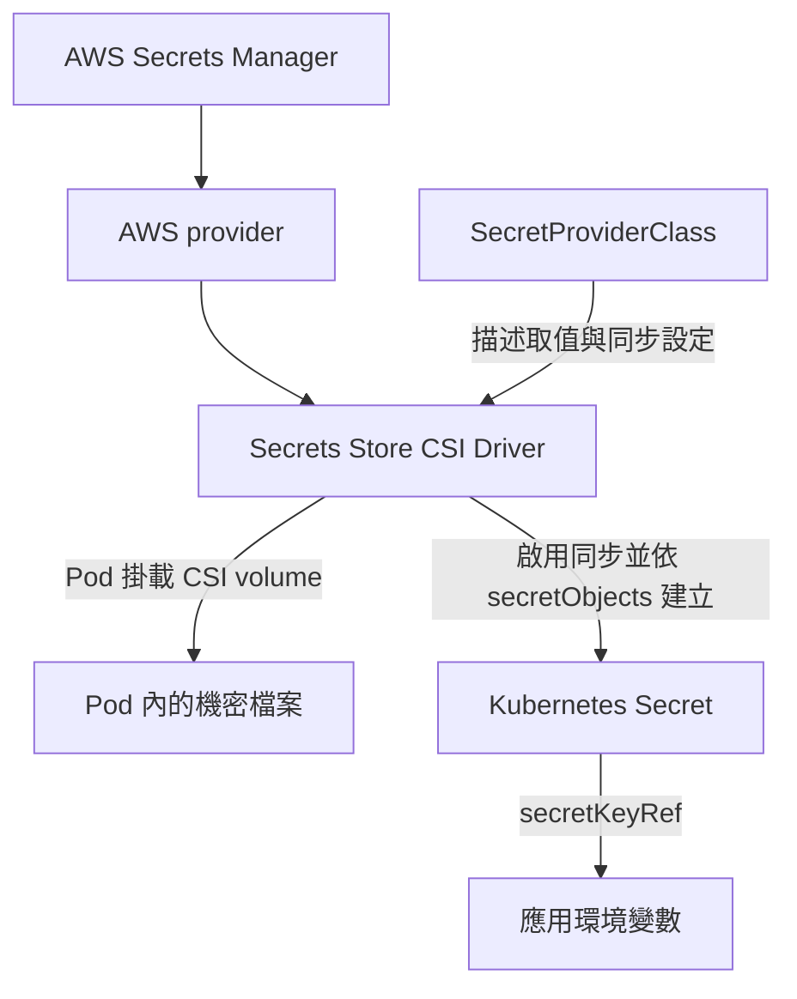

這次在 EKS 部署服務，將應用需要的機密資料放在 AWS Secrets Manager，再透過 Secrets Store CSI Driver 提供給 Pod。SecretProviderClass 已經建立，裡面也設定了 `secretObjects`，但應用啟動時仍然出現 Secret 找不到的錯誤。

原本以為設定套用後，CSI 就會同步建立 Kubernetes Secret。後來才發現，還有一個控制同步功能的屬性沒有開啟：`syncSecret.enabled`。更新這個設定後，Secret 就能正常同步，問題也隨之解決。

## 掛載檔案與同步 Secret 是兩件事

Secrets Store CSI Driver 搭配 AWS provider，可以將 AWS Secrets Manager 的資料掛載成 Pod 內的檔案。如果應用透過 `secretKeyRef` 讀取環境變數，則還需要將資料同步成 Kubernetes Secret。



這兩種使用方式共用資料來源，但需要的設定不同。`SecretProviderClass` 的 `parameters` 描述要從 AWS 取得哪些資料；`secretObjects` 則描述同步後的 Kubernetes Secret 名稱、類型與 keys。[AWS provider 官方說明](https://github.com/aws/secrets-store-csi-driver-provider-aws)

此外，**必須有 Pod 掛載對應的 CSI volume，才會觸發同步**。單獨建立 SecretProviderClass，不會立即產生 Kubernetes Secret。[CSI Secret 同步文件](https://secrets-store-csi-driver.sigs.k8s.io/topics/sync-as-kubernetes-secret)

## SecretProviderClass 已存在，Secret 卻沒有出現

以下將資源名稱統一替換為範例名稱。當時的 SecretProviderClass 已經包含同步設定：

```yaml
apiVersion: secrets-store.csi.x-k8s.io/v1
kind: SecretProviderClass
metadata:
  name: app-database-secret
  namespace: app
spec:
  provider: aws
  secretObjects:
    - secretName: app-db-secret
      type: Opaque
      data:
        - objectName: db-user
          key: db-user
        - objectName: db-password
          key: db-password
  parameters:
    region: ap-northeast-1
    objects: |
      - objectName: "<SECRETS_MANAGER_SECRET_ARN>"
        objectType: secretsmanager
        jmesPath:
          - path: username
            objectAlias: db-user
          - path: password
            objectAlias: db-password
```

這份設定會擷取 Secrets Manager JSON 裡的 `username` 與 `password`，透過別名 `db-user`、`db-password` 對應掛載內容，再同步到 `app-db-secret` 的同名 keys。

但查詢資源時，卻出現兩種不同結果：

```bash
kubectl get secretproviderclass -n app
kubectl get secret app-db-secret -n app
```

SecretProviderClass 已存在，Kubernetes Secret 卻回傳 `NotFound`。這讓我把注意力轉向 driver 本身的同步設定：SPC 定義了「要同步什麼」，但 driver 是否已啟用這項功能，還是另一個條件。

## 找到原因：syncSecret.enabled 沒有開啟

這次 CSI driver 是透過 Helm 管理，因此先查實際的 release 名稱：

```bash
helm list -n kube-system
```

找到 `secrets-store-csi-driver` 後，讀取包含預設值的完整設定：

```bash
helm get values secrets-store-csi-driver \
  -n kube-system \
  --all
```

關鍵就在這個屬性：

```yaml
syncSecret:
  enabled: false
```

雖然 SecretProviderClass 已經寫了 `secretObjects`，但 Helm 設定中的 `syncSecret.enabled` 仍是 `false`，沒有啟用同步所需的 RBAC。

`syncSecret.enabled` 屬於 **Secrets Store CSI Driver 的 Helm values**，應修改 driver 的設定。它不是 SecretProviderClass 的欄位，也不是 Pod annotation。官方 chart 將這個屬性用於控制同步 Kubernetes Secret 所需的 roles 與 bindings。[CSI Helm chart 設定說明](https://github.com/kubernetes-sigs/secrets-store-csi-driver/blob/main/charts/secrets-store-csi-driver/README.md)

這也解釋了為什麼只查看 driver container 的啟動參數，無法直接判斷同步功能是否開啟。這個設定主要影響 RBAC，不會以一個同名的 `--sync-secret` 參數出現在 container args 裡。

## 更新屬性後，Secret 正常同步

找到原因後，處理方式就是更新現有 Helm release，將 `syncSecret.enabled` 改成 `true`。

先加入官方 chart repository：

```bash
helm repo add secrets-store-csi-driver \
  https://kubernetes-sigs.github.io/secrets-store-csi-driver/charts
helm repo update
```

接著更新 driver。以下使用當時的 release 名稱、namespace 與 chart 版本 `1.6.0`；套用到其他環境時，需使用該環境實際的值：

```bash
helm upgrade secrets-store-csi-driver \
  secrets-store-csi-driver/secrets-store-csi-driver \
  --version 1.6.0 \
  -n kube-system \
  --reuse-values \
  --set syncSecret.enabled=true
```

`--reuse-values` 保留原有 release 設定，再覆寫這次要調整的屬性。更新後的值為：

```yaml
syncSecret:
  enabled: true
```

官方安裝文件也將 `syncSecret.enabled=true` 列為啟用 Kubernetes Secret 同步的設定。[CSI 安裝文件](https://secrets-store-csi-driver.sigs.k8s.io/getting-started/installation)

更新這個屬性後，在 Pod 掛載對應 CSI volume 的情況下，`secretObjects` 定義的 Kubernetes Secret 就正常建立了，這次同步問題也就解決。

這次漏掉的是 driver 層的同步開關。SecretProviderClass 負責定義同步內容，Pod 掛載觸發資料讀取，而 `syncSecret.enabled` 則提供同步 Kubernetes Secret 所需的權限設定；三者配合，才能讓 Secrets Manager 的資料順利提供給透過 Kubernetes Secret 取值的應用。
